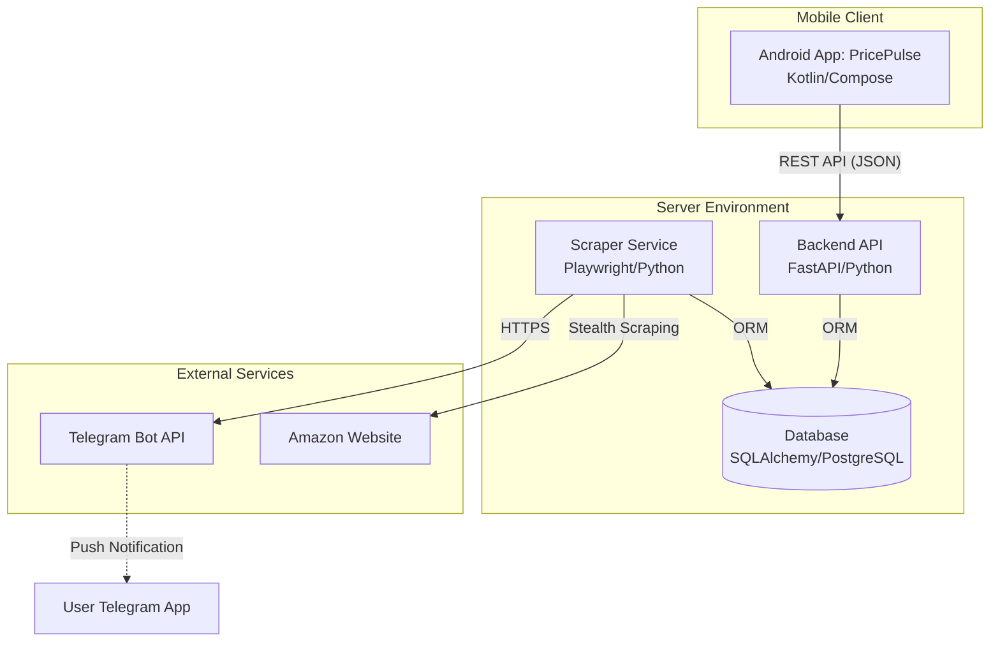

# PricePulse 📉

PricePulse is a full-stack Amazon wishlist tracker that monitors price drops (both New and Used) and notifies you via Telegram. It features a modern Android application, a FastAPI backend, and a stealthy Playwright-based scraper.

## 🗺️ System Overview

### Use Case Diagram
Describes the primary interactions between the User, PricePulse, and External Services.

```mermaid
useCaseDiagram
    actor User
    actor Telegram
    actor Amazon

    User --> (Add/Manage Wishlists)
    User --> (View Price History Graphs)
    User --> (Sort & Filter Items)
    User --> (Share Deals / Buy Now)
    User --> (Manual Refresh)

    (Background Scraping) --> Amazon : Fetch Prices
    (Background Scraping) --> (Database) : Save History
    (Background Scraping) --> Telegram : Send Price Drop Alert
    Telegram --> User : Notification
```

### High-Level Architecture (C4 Container Diagram)
Shows the internal technical containers and how they communicate.



## 🚀 Features

### 📱 Android App (PricePulse)
- **Visual Dashboards:** Group items by wishlist with collapsible sections.
- **Price History:** View interactive charts of how prices have changed over time.
- **Dynamic Management:** Add, delete, and manage wishlist URLs directly from the app.
- **Stealth Integration:** Click on any item image or wishlist header to jump directly to the Amazon page.
- **Modern UI:** Material 3 design, Dynamic Color support (Android 12+), and native Dark Mode.
- **Smart Actions:** Share deals with friends or "Buy Now" with one tap.

### 🕵️ Stealth Scraper
- **Smart Tracking:** Records price history only when a change occurs to save space.
- **Anti-Bot Measures:** Uses randomized User-Agents and human-like jitter delays between requests.
- **Used Price Detection:** Specifically designed to find the best "Used" (De 2ª mano) deals, often providing massive savings.

### ⚙️ Backend API
- **FastAPI Powered:** High-performance API for item management and history retrieval.
- **Automated Cleanup:** ILM policy automatically prunes old history data points to keep the database efficient.

---

## 🛠️ Setup Instructions

### 1. Backend & Scraper Configuration
Configure your settings in `amazonPriceUpdateNotifier.properties` or via Environment Variables:

| Property | Env Var | Description |
|----------|---------|-------------|
| `telegram.token` | `TELEGRAM_TOKEN` | Your Telegram Bot API token. |
| `telegram.chatid` | `TELEGRAM_CHAT_ID` | Your Telegram chat ID. |
| `notification.savings.percentage` | - | Minimum % drop to trigger a notification (e.g., `0.10`). |
| `history.limit` | - | Max data points to keep per item (default `100`). |

### 2. Running the System

#### Using Docker (Recommended)
1. Build and run the entire stack (DB, API, Scraper):
   ```bash
   docker-compose up --build -d
   ```
2. View logs: `docker-compose logs -f`

#### Manual Execution
1. Install dependencies: `pip install -r requirements.txt`
2. Initialize Database: `python -c 'from models import init_db; init_db()'`
3. Start Scraper: `python amazonPriceUpdateNotification.py`
4. Start API: `python api.py`

### 3. Android App Setup
1. Open the `android_app` folder in Android Studio.
2. Update `WishlistApi.kt` with your server's IP address:
   ```kotlin
   private const val BASE_URL = "http://YOUR_SERVER_IP:8010/"
   ```
3. Build and install the APK on your device.
4. Open **PricePulse**, tap the **Settings** icon, and add your first Amazon Wishlist URL!

---

## 📋 Requirements
- **Python 3.9+**
- **PostgreSQL** (for production) or SQLite.
- **Playwright** (run `playwright install chromium` after installing requirements).
- **Android SDK 24+** (Android 7.0+).

## 📄 License
This project is for educational purposes. Please respect Amazon's Terms of Service regarding scraping.
