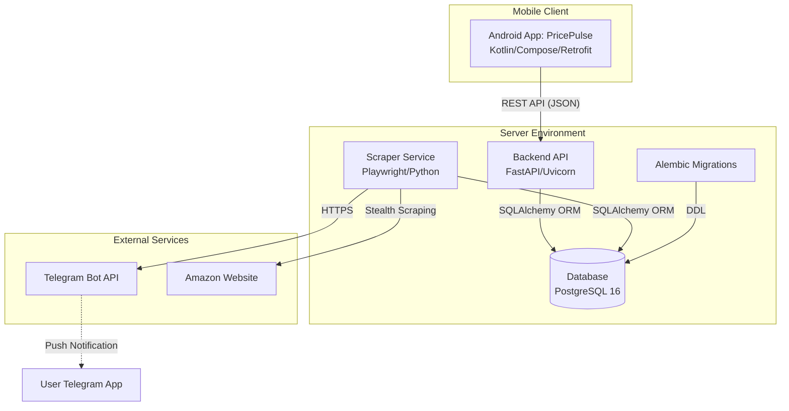

# PricePulse 📉

PricePulse is a full-stack Amazon wishlist tracker that monitors price drops (both New and Used) and notifies you via Telegram. It features a modern Android application, a FastAPI backend, and a stealthy Playwright-based scraper.

## 🗺️ System Overview

### Use Case Diagram
Describes the primary interactions between the User, PricePulse, and External Services.

```mermaid
useCaseDiagram
    actor User
    actor Telegram
    actor Amazon

    User --> (Add/Manage Wishlists)
    User --> (View Price History Graphs)
    User --> (Sort & Filter Items)
    User --> (Share Deals / Buy Now)
    User --> (Manual Refresh)
    User --> (Configure App Settings)

    (Background Scraping) --> Amazon : Fetch Prices
    (Background Scraping) --> (Database) : Save History
    (Background Scraping) --> Telegram : Send Price Drop Alert
    Telegram --> User : Notification
```

### High-Level Architecture (C4 Container Diagram)
Shows the internal technical containers and how they communicate.



## 🚀 Features

### 📱 Android App (PricePulse)
- **Visual Dashboards:** Group items by wishlist with collapsible sections and intuitive navigation.
- **In-App Notifications:** Real-time synchronization of price drop alerts.
- **Price History:** Interactive charts visualize price trends over time (New vs. Used).
- **Wishlist Management:** Add, delete, and manage multiple Amazon wishlist URLs directly from the UI.
- **Global Settings:** Configure notification thresholds (e.g., minimum savings percentage) from the app.
- **Modern UI:** Built with Jetpack Compose, Material 3, and support for Dynamic Color (Android 12+).
- **Deep Linking:** Tap images or headers to jump directly to the Amazon product page.

### 🕵️ Stealth Scraper
- **Playwright-Powered:** Uses browser automation with stealth plugins to avoid detection.
- **Smart Tracking:** Intelligent history logging only records changes, optimizing database storage.
- **Anti-Bot Measures:** Randomized User-Agents and human-like jitter delays.
- **Used Price Detection:** Specialized in finding "Used - Like New" (De 2ª mano) deals for maximum savings.

### ⚙️ Backend API & Data
- **FastAPI Core:** High-performance asynchronous API handles all mobile client requests.
- **Alembic Migrations:** Robust database schema management and versioning.
- **Automated Cleanup (ILM):** Integrated Information Lifecycle Management prunes old history data (default: 100 points per item).
- **Dockerized Stack:** Fully containerized for easy deployment with Postgres 16.

---

## 🛠️ Setup Instructions

### 1. Configuration
Settings can be managed via `amazonPriceUpdateNotifier.properties` or Environment Variables:

| Property | Env Var | Description |
|----------|---------|-------------|
| `telegram.token` | `TELEGRAM_TOKEN` | Your Telegram Bot API token. |
| `telegram.chatid` | `TELEGRAM_CHAT_ID` | Your Telegram chat ID. |
| `notification.savings.percentage` | `MIN_SAVINGS` | % drop to trigger a notification (e.g., `0.10`). |
| `history.limit` | `HISTORY_LIMIT` | Max data points per item (default `100`). |
| `used.condition.keywords` | - | Keywords to identify used items (e.g., `Used,Usado`). |

### 2. Running the System

#### Using Docker (Recommended)
1. Launch the stack (Database, API, Scraper, Migrations):
   ```bash
   docker-compose up --build -d
   ```
2. The system automatically runs Alembic migrations on startup via `entrypoint.sh`.

#### Manual Execution
1. Install dependencies: `pip install -r requirements.txt`
2. Run migrations: `alembic upgrade head`
3. Start Scraper: `python amazonPriceUpdateNotification.py`
4. Start API: `python api.py`

### 3. Android App Setup
1. Open the `android_app` project in Android Studio.
2. Update `BASE_URL` in `WishlistApi.kt` to point to your server's IP.
3. Build and install. Use the **Settings** screen to configure your server preferences!

---

## 📋 Requirements
- **Python 3.12+**
- **PostgreSQL 16**
- **Playwright** (run `playwright install --with-deps` if running manually)
- **Android SDK 24+** (Android 7.0+)

## 📄 License
This project is for educational purposes. Please respect Amazon's Terms of Service regarding automated access.
